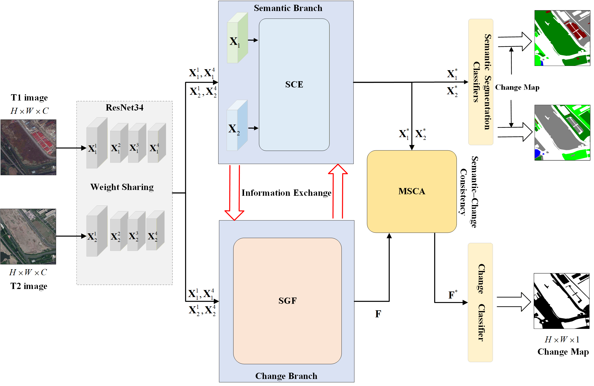

# SCGNet

This repository provides the code for the method in our paper '**SCGNet: Semantic Correlation Guided Network for Remote Sensing Semantic Change Detection**'. **IEEE Transactions on Geoscience and Remote Sensing (TGRS), 2026**

If you have any questions, you can send me an email. My mail address is 24171213924@stu.xidian.edu.cn.

## Overview

<p align="center">
  
</p>
SCGNet is a deep learning network for **remote sensing semantic change detection**. It works through three modules:

- **SGF** (Semantic-Guided Fusion)
- **SCRE** (Semantically Consistent Region Enhancement)
- **MSCA** (Multi-scale Change Activation)


## Requirements

- Python 3.8+
- PyTorch 1.7+
- torchvision
- scikit-image
- numpy
- tensorboardX

## Datasets

- **SECOND**
- **Landsat-SCD**

## Training

```bash
# Train on SECOND dataset
python train_SECOND.py

# Train on Landsat-SCD dataset
python train_Landsat.py
```

## Inference

```bash
python inference.py
```

